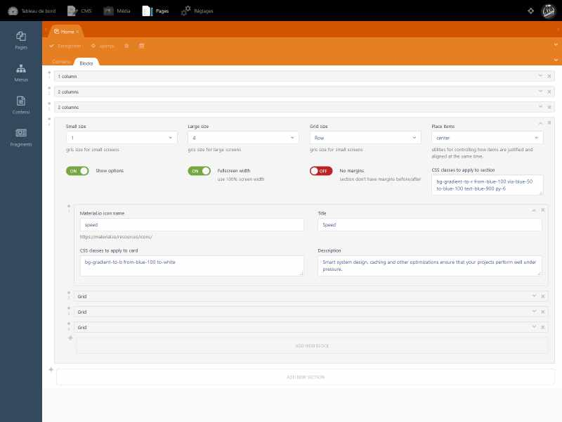
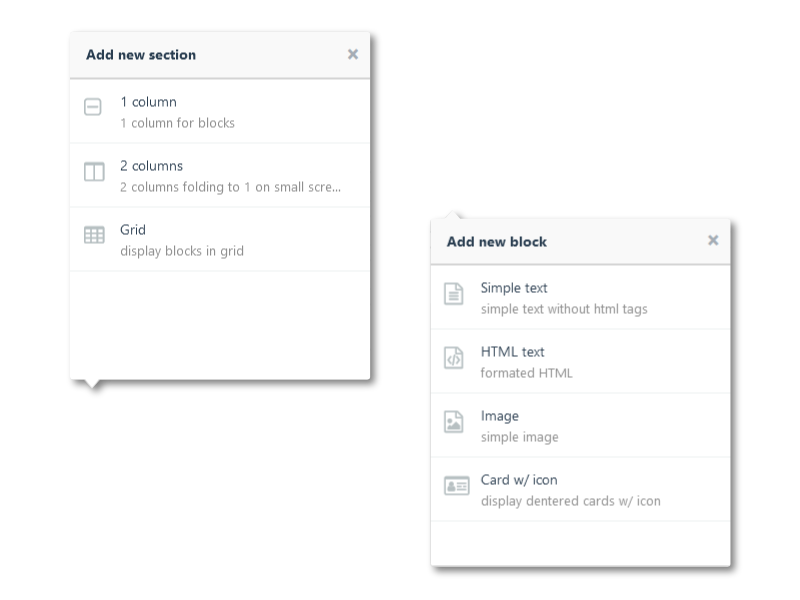

# Winter CMS - Blocks Theme
Winter CMS theme that demonstrates the use of repeater groups to assemble static pages with customizable building sections and blocks.
Each section, depending oh his type, can have one or more blocks.
## Installation
(let assume you're in the root of your winter installation)
### Using composer
Just run this command
```
composer require hounddd/wn-blocks-theme
```

### Cloning repo
Clone this repo into your winter themes folder.

```
cd themes
git clone https://github.com/liip/oc-blocks-theme.git blocks
```
## Usage
NOTE: the name **blocks** is important, if you change the themes name you have to alter some files to match the path.
 - the groups attribute in the `layouts/default.htm` repeater.
 - the groups attribute in the `meta/sections.yaml` repeater.


In your backend, check for the [static pages plugin](https://github.com/wintercms/wn-pages-plugin) to be installed. If you go to the "Pages" and edit home page, you now have a blocks tab where you can add different sections/blocks, enter data and even rearrange their order.



## Adjust to your needs
See [Winter CMS backend forms](https://wintercms.com/docs/backend/forms) documentation to see how setting new field definitions.
### Adding sections
To add more section types, edit `meta/sections.yaml` file.

In your field definition simply add
```
my-section-type:
    name: My awesome section
    description: display a section
    icon: icon-table
    content:
        type: repeater
        prompt: Add new block
        style: accordion
        groups: themes/blocks/meta/blocks.yaml
```
**Important**: Each section definition has a corresponding partial file named `partials/blocks/{section_name}.htm`.  The form data is passed as 'data'.



### Adding blocks
To add more block types, edit `meta/blocks.yaml` file.

In your field definition simply add
```
text:
    name: Simple text
    description: simple text without html tags
    icon: icon-file-text-o
    fields:
        content:
            label: Content
            span: left
            type: textarea
            size: small
```
**Important**: Each block definition has a corresponding partial file named `partials/blocks/content/{block_name}.htm`.  The form data is passed as 'content'.


